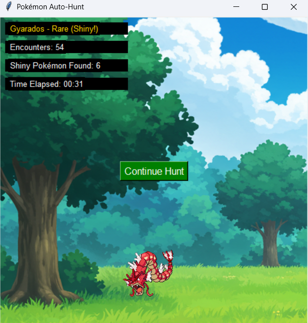

# IdleMon - Automated Shiny Hunting Simulator

This project simulates encountering Pokémon with a chance of finding shiny Pokémon. It features animated GIFs for Pokémon encounters, shiny tracking, encounter statistics, and customization options.


## For Linux
https://github.com/mixoploidy8031/idlemon/tree/linux

## Features
- **Encounter simulation:** Displays Pokémon with their respective rarities
- **Shiny hunting:** Tracks total shinies found with a 1/2000 chance
- **Animated sprites:** Shows normal and shiny Pokémon as animated GIFs
- **Statistics tracking:** 
  - Real-time encounter counter (resets after continuing from a shiny)
  - Time elapsed tracker
  - Total shinies found counter
- **Sound effects:** 
  - Shiny encounter notification
  - Continue button confirmation
  - Optional muting through config
- **User-friendly customization:** Easily configure settings through a simple config.json file - no coding required!
  - Choose your own background image
  - Toggle sound effects on/off



---

## Requirements
For building from source:
- Python 3.8 or later
- Required libraries: `Pillow`, `pygame`, `tkinter`, `colorama`

Install dependencies:
```bash
pip install pillow pygame colorama
```

---

## Usage

### Windows Portable Version
1. Download the latest release
2. Extract the zip file anywhere you like
3. Run `IdleMon.exe` from the extracted folder

The application is fully portable:
- Can be run from any location
- All data is stored in the application folder
- No installation required
- No system modifications

### Building from Source
1. Clone the repository
2. Install dependencies:
   ```bash
   pip install pillow pygame colorama pyinstaller
   ```
3. Build the executable:
   ```bash
   pyinstaller main.spec
   ```
4. The portable version will be created in `dist/IdleMon`

---

## Configuration
The simulator can be customized using a `config.json` file placed in the same folder as the executable:

### Example `config.json`
```json
{
    "background_image": "C:/Users/YourName/Pictures/custom_background.png",
    "mute_audio": false
}
```

### Key Settings
- **`background_image`:** Path to background image. Can be:
  - Absolute path (e.g., "C:/Users/YourName/Pictures/custom_background.png")
  - Relative path from executable (e.g., "assets/images/custom_background.png")
  - Defaults to included background if not found
- **`mute_audio`:** Set to `true` to disable all sound effects (default: `false`)

### Portable Directory Structure
```
IdleMon/
├── IdleMon.exe
├── assets/
│   ├── gifs/
│   │   ├── gen1/
│   │   │   ├── normal/
│   │   │   └── shiny/
│   │   ├── gen2/
│   │   │   ├── normal/
│   │   │   └── shiny/
│   │   ├── gen3/
│   │   │   ├── normal/
│   │   │   └── shiny/
│   │   ├── gen4/
│   │   │   ├── normal/
│   │   │   └── shiny/
│   │   └── gen5/
│   │       ├── normal/
│   │       └── shiny/
│   ├── sounds/
│   │   ├── shiny_sound1.wav
│   │   └── continue_sound1.wav
│   ├── data/
│   │   ├── gen1_pokemon_names.txt
│   │   ├── gen2_pokemon_names.txt
│   │   ├── gen3_pokemon_names.txt
│   │   ├── gen4_pokemon_names.txt
│   │   └── gen5_pokemon_names.txt
│   └── images/
│       └── background.png
├── config.json (optional)
└── logs/      (created automatically)
    ├── shiny_count.bin
    ├── shinies_encountered.txt
    └── error.log
```

---

## Features Guide

### Encounter System
- Each encounter has a chance of being shiny (1/2000 by default)
- When a shiny is found:
  1. The encounter animation changes
  2. A sound plays (if not muted)
  3. The encounter count remains displayed
  4. A continue button appears
- After pressing continue:
  1. The encounter counter resets to 0
  2. A new hunting session begins

### Sound System
- Shiny encounters trigger a special sound effect
- Continue button plays a confirmation sound
- Optional muting through config.json

### Statistics Tracking
- Real-time encounter counter (resets after continuing from a shiny)
- Elapsed time tracker
- Total shiny Pokémon found
- Automatic data saving for shiny counts

### Resetting Progress
To reset your hunting progress, you can either:

Delete individual files:
1. Navigate to the `logs` directory in your IdleMon folder
2. Delete these files:
   - `shiny_count.bin` (resets total shinies to 0)
   - `shinies_encountered.txt` (clears shiny encounter history)

OR

Simply delete the entire `logs` directory.
New files will be automatically created when you next run the program.

---

## Troubleshooting
- **Missing GIFs:** Ensure GIF files exist in the correct generation's normal/shiny directories
- **Animation Issues:** Verify GIF files are properly formatted
- **Sound Problems:** Check that sound files exist in the assets/sounds directory
- **Background Image:** Ensure the specified path exists and is accessible
- **config.json:** Ensure the config.json file is correctly formatted and all paths are valid

---

## License
This project is licensed under the MIT License.
